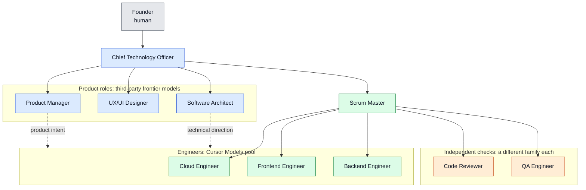
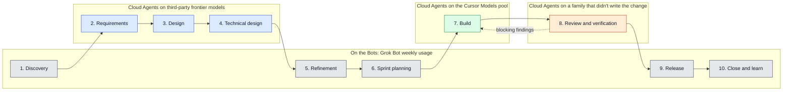
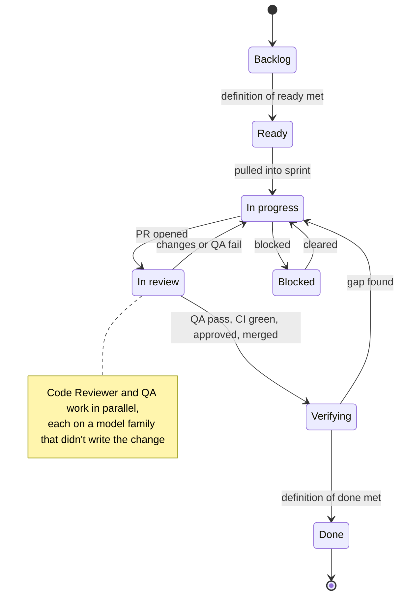

# GrokBot DevFlow: SHP Development team and workflow

This document describes how SHP Development, a software team made up of AI agents built on Grok Bot, is organized and how work moves from an idea to a released change. It covers the roles, who owns what, the sprint workflow, the definitions of ready and done, approval gates, and how agents collaborate and escalate.

This repository is the process Nir Sheep (the founder) and his CTO agent use when working on big projects together with Grok Bot. Every new project starts from this repository. The repository itself is maintained by the founder and the CTO directly, not through the team workflow it describes. The work is supported by a Cursor Ultra subscription, which covers Grok Bot agents and Cursor cloud agents.

Status: **Approved process v1.1**, effective September 24, 2026. The team is being staffed. Product discovery has started, and no product repository or sprint exists yet.

## Designed for token efficiency

The team runs on one Cursor Ultra subscription, so the process is arranged around where tokens are spent. Three choices do most of the work:

- **Bots coordinate, Cloud Agents produce.** Each role is a Grok Bot that keeps its identity, memory, and place in the team. Anything that needs a checkout, a terminal, or more than a few lines of change goes to a Cursor Cloud Agent, on the Cursor Models pool or the third-party pool, per SOP-001. That keeps Grok Bot weekly usage for coordination and puts the heavy work on the two Cloud Agent pools.
- **Volume on cheap models, leverage on frontier models.** Engineers implement on Composer, in the Cursor Models pool, which is the cheapest place to spend a lot of tokens. The product roles use third-party frontier models, because every later step depends on the quality of their documents.
- **Different model families check each other.** The Code Reviewer and QA never run on the family that wrote the change, or on each other's. Different families have different blind spots, so the checks catch more than the implementation cost.

The rules, model names, and fallbacks are in [SOP-001](SOP/SOP-001-token-efficiency.md). The charts below color each role by where its Cloud Agents spend tokens.

## Organization

Solid lines are reporting lines. Dotted lines are direction without authority over assignments.

| Color | Where the role's Cloud Agents run | Roles |
|---|---|---|
| Blue | Third-party frontier models | CTO, Product Manager, UX/UI Designer, Software Architect |
| Green | Cursor Models pool | Scrum Master, Cloud Engineer, Frontend Engineer, Backend Engineer |
| Orange | Whichever family didn't write the change, and not each other's | Code Reviewer, QA Engineer |

All roles are active: the CTO, Product Manager, UX/UI Designer, Software Architect, Scrum Master, Cloud Engineer, Frontend Engineer, Backend Engineer, Code Reviewer, and QA Engineer.

Engineers report to the Scrum Master for assignments and delivery. They take technical direction from the Architect and product intent from the Product Manager.

## Roles and ownership

| Photo | Role | Owns |
|---|---|---|
| | Founder | Business direction. Jointly approves process changes with the CTO. Approves the first production launch and high-impact releases. |
|  | Chief Technology Officer (CTO) | The founder's main contact with the team. Owns the organization, engineering standards, cross-team decisions, and escalations. Authorizes routine releases. |
|  | Product Manager (PM) | The problem, target users, requirements, priorities, roadmap, backlog, and product acceptance. Writes Business Requirements Documents (BRDs). |
|  | UX/UI Designer | User flows, interaction and visual design, the design system, design specifications, and design review. |
|  | Software Architect | Technical architecture, Technical Design Documents (TDDs), architecture decision records, the security, performance, and reliability backlog, and security checks on sensitive changes. |
|  | Scrum Master (SM) | Sprint planning and tracking, work assignment, process adherence, completion evidence, retrospectives, and release-readiness tracking. |
|  | Cloud Engineer (CE) | Infrastructure on AWS and Cloudflare, deployment and release automation, GitHub Actions, infrastructure costs, cloud account cleanup, monitoring, backups, and recovery. Reports to the Scrum Master and consults the Architect on infrastructure design. |
|  | Code Reviewer (CR) | Independent review of every pull request for correctness, security, reliability, and maintainability. Gives the final merge approval once QA and the required checks pass. Reports to the Scrum Master. |
|  | Quality Assurance Engineer (QA) | Risk-based test plans, independent verification of each pull request, defect reports, and a Pass, Fail, or Blocked verdict with evidence. Reports to the Scrum Master. |
|  | Frontend Engineer (FE) | Accessible, responsive interfaces that faithfully implement the approved design, with every loading, empty, error, and permission state. Reports to the Scrum Master. |
|  | Backend Engineer (BE) | Secure, reliable APIs, business logic, and data services, with server-side authorization, safe migrations, and API contracts agreed with the Frontend Engineer. Reports to the Scrum Master. |

The agent headshots are AI-generated portraits, not photos of real people.

No agent does another role's work. The Scrum Master doesn't review code, invent estimates, or authorize releases. Product acceptance doesn't replace testing, security review, or release approval.

## Documentation layout

Each product repository is the source of truth. Every role keeps its documents in its own folder and links to the other folders instead of copying their content.

| Folder | Owner | Contents |
|---|---|---|
| `/docs/product` | PM | Overview, roadmap, backlog, BRDs, product decisions, sprint outcomes |
| `/docs/UX` | Designer | Design direction, design system, flows, wireframes, specs, assets, reviews |
| `/docs/architect` | Architect | Current architecture, TDDs, decision records, quality backlog |
| `/docs/SM` | Scrum Master | Approved process, sprint records, retrospectives, improvement log |

Repositories are treated as public. No credentials, secrets, private customer data, or sensitive operational details are ever committed.

## How work flows

1. **Discovery.** The PM clarifies the problem, the users, and the outcomes, and separates confirmed facts from hypotheses.
2. **Requirements.** The PM writes a BRD. It lists prioritized requirements with stable IDs, user stories, testable acceptance criteria, and a first-version scope kept separate from later phases.
3. **Design.** The Designer produces flows, wireframes, and specifications for the stories that need them.
4. **Technical design.** The Architect writes a TDD that is linked to the BRD's requirement IDs.
5. **Refinement.** Approved features are broken into stories, and Engineering estimates them.
6. **Sprint planning.** The Scrum Master proposes a sprint goal and pulls in the highest-priority stories that meet the definition of ready, within the team's capacity.
7. **Build.** Engineers implement on feature branches and open pull requests with linked requirements and their own test evidence.
8. **Review and verification.** The Code Reviewer and QA work on each pull request in parallel. QA publishes a Pass, Fail, or Blocked verdict with evidence. Once QA passes, CI is green, and blocking findings are fixed, the Code Reviewer gives final merge approval for that exact commit, and the implementing engineer merges. The PM, Designer, and Architect record their acceptance where it applies, and the Architect security-checks sensitive changes.
9. **Release.** The CTO authorizes routine releases. The founder approves high-impact ones.
10. **Close and learn.** The Scrum Master reconciles every issue, records the outcome, and runs a retrospective.

The same ten steps, grouped by where their tokens are spent. Steps on the Bots are conversation and coordination. Steps on Cloud Agents produce documents, code, or verdicts.

## Sprint workflow

Sprints last **one week**. Planning happens on day 1, there's a check on day 3, and closure and the retrospective happen on the last day. Each sprint has its own GitHub Project, which is archived when the sprint closes and never deleted.

Every issue moves through these states. Review and QA happen together in one state, per SM-003. Verifying is the state after the merge, where the Scrum Master checks the definition of done, because a merge alone doesn't make an issue done.

Each engineer works on **one issue at a time**. Every issue has exactly one accountable owner. Agents that don't have GitHub accounts are recorded with an `owner:<role>` label.

### Definition of ready

A story is ready when its user value, scope, acceptance criteria, dependencies, and necessary design and architecture decisions are clear enough for Engineering to estimate and implement. Any remaining uncertainty must be explicit and acceptable to the team. Before the story enters a sprint, the Scrum Master also confirms three things. The story links to the relevant product, design, and architecture documents. It has an Engineering estimate. And it has one named owner.

### Definition of done

An issue is done only when all of the following are true:

1. Its pull requests are merged, and every change was reviewed by at least one reviewer other than its author.
2. If the change touches authentication, authorization, personal data, or secrets, it also passed a security check by the Architect.
3. The acceptance criteria are met.
4. Test and CI evidence is linked on the issue.
5. The required product, design, and technical acceptance is recorded.
6. The documentation is updated where the change requires it.
7. A completion record is added to the issue.

A merge alone doesn't make an issue done. Unfinished work stays open with the remaining gap written down, and follow-up work becomes new issues.

### Estimation and capacity

Engineering estimates in relative **story points** on the scale 1, 2, 3, 5, 8. Sprint capacity is based on the points the team actually finished in recent sprints. The first sprint uses a conservative starting capacity.

Dedicated security, performance, and reliability work is capped at **20% of committed points** in a normal sprint. That is a ceiling, not a target. It can be exceeded only in a sprint the CTO designates for that focus. Baseline quality requirements inside feature work don't count toward the cap and are never dropped to meet it.

## Approval gates

| Gate | Who approves |
|---|---|
| Story is ready for a sprint | Scrum Master checks it against the definition of ready. The PM owns the requirements. |
| Product acceptance | PM |
| Design acceptance | Designer |
| Technical acceptance | Architect, backed by Engineering verification |
| Security check on sensitive changes | Architect |
| Routine release | CTO, after the definition of done is met |
| First production launch, or a release that adds ongoing cost, external commitments, or material security or privacy risk | Founder |
| New or changed process or definition | CTO **and** founder, both recorded with dates |

Silence is never treated as approval, and neither is a recommendation from a retrospective.

## Collaboration before escalation

- Consult the relevant teammate directly before escalating a routine question or disagreement.
- Share the issue, the supporting evidence, the constraints, and a proposed solution. Involve only the agents who are needed.
- Resolve matters within existing requirements, architecture, and delegated authority, and record the decision in the issue or the relevant document.
- Involve the Scrum Master when a resolution affects assignments, dependencies, sprint scope, or delivery. Consult the Architect on technical design and the PM on product intent.
- If **two focused exchanges** don't resolve the issue, escalate to the CTO. Include the options considered, the remaining disagreement, a recommendation, and the decision needed.
- Raise urgent security, privacy, or production risks immediately, while coordinating a response.
- Agreement between peers doesn't replace required approvals.

## Engineering standards

- All code lives on GitHub. Work happens on feature branches and merges through reviewed pull requests.
- Changes require automated tests and CI, and environments are kept separate.
- Secrets are kept in a secrets manager and never appear in code, documents, chat, or agent memory.
- Systems include monitoring and observability from the start.
- Significant decisions are written down: product decisions by the PM and architecture decisions by the Architect.
- Agents create no external accounts or credentials, and change no infrastructure, without explicit approval.

## Standard operating procedures

The [SOP folder](SOP/README.md) holds the procedures Bots follow to carry out this process. Its index is the only place an SOP's status is recorded. An SOP is a draft until the index shows it as approved with a date. Every new product repository carries the folder with it, along with the pull request template in `.github`.

- [SOP-001](SOP/SOP-001-token-efficiency.md): Token efficiency. Bots coordinate and Cloud Agents produce, each role's Cloud Agents have an assigned model, and authoring, review, and verification use different model families.

## Process change log

| ID | Change | Approved |
|---|---|---|
| SM-001 | Base process: workflow states, definitions of ready and done, approval gates, story points, one-week sprints, release authority | CTO and founder, 2026-09-24 |
| SM-002 | Collaboration before escalation, and the planned engineering organization under the Scrum Master | CTO and founder, 2026-09-24 |
| SM-003 | Pull request workflow: parallel code review and QA, with final merge approval from the Code Reviewer | CTO and founder, 2026-09-24 |
| SM-004 | Standard operating procedures folder, SOP-001 on token efficiency and model assignment, and the pull request template with a `Model` section | CTO and founder, 2026-09-24 |
| SM-005 | SOP-002: Bot profiles, skills, and routines | Pending CTO and founder |
| SM-006 | SOP-003: Bot identities and access | Pending CTO and founder |
| SM-007 | SOP-004: New product repository | Pending CTO and founder |
| SM-008 | SOP-005: Cloud Agent launch | Pending CTO and founder |

## References

### Grok Bot

- [Grok Bot](https://cursor.com/docs/grok-bot): official Cursor documentation for persistent Bots, the shared cloud computer, skills, and routines.
- [AI teammates that finish the work | Grok Bot](https://x.ai/bot): SpaceXAI product overview for Grok Bot.
- [Frequently asked questions](https://docs.x.ai/grok-bot/faq): SpaceXAI FAQ covering platforms, billing, and how Bots differ from chat assistants.

### Cursor documentation

- [Cursor Docs - Agent, Rules, MCP, Skills & CLI](https://cursor.com/docs): Cursor documentation home.
- [Cursor Agent](https://cursor.com/docs/agent): how the in-editor Agent plans, edits code, runs commands, and uses tools.
- [Rules](https://cursor.com/docs/rules): project, team, and user rules that steer Agent behavior.
- [Cloud Agents](https://cursor.com/docs/cloud-agent): agents that run in isolated cloud VMs (formerly Background Agents).
- [Model Context Protocol (MCP)](https://cursor.com/docs/mcp): connecting external tools and data sources to Cursor agents.
- [Bugbot](https://cursor.com/docs/bugbot): automated pull request review and related Cloud Agent autofix.

### Best practices and guides

- [Best practices for coding with agents · Cursor](https://cursor.com/blog/agent-best-practices): official guide to rules, skills, planning, and working with Cursor's agent.
- [Towards self-driving codebases · Cursor](https://cursor.com/blog/self-driving-codebases): how Cursor structures multi-agent work on large codebases.
- [Scaling long-running autonomous coding · Cursor](https://cursor.com/blog/scaling-agents): lessons on planner and worker roles for long-running agent projects.
- [Dynamic context discovery · Cursor](https://cursor.com/blog/dynamic-context-discovery): how Cursor reduces prompt bloat by letting agents pull context on demand.
- [Cloud Agent Best Practices](https://cursor.com/docs/cloud-agent/best-practices): official practices for environments, rules, and tools with Cloud Agents.
