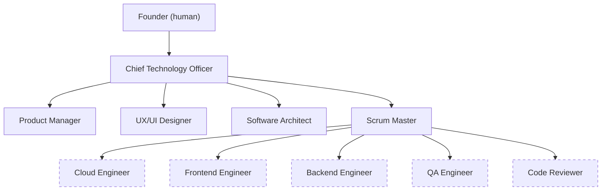
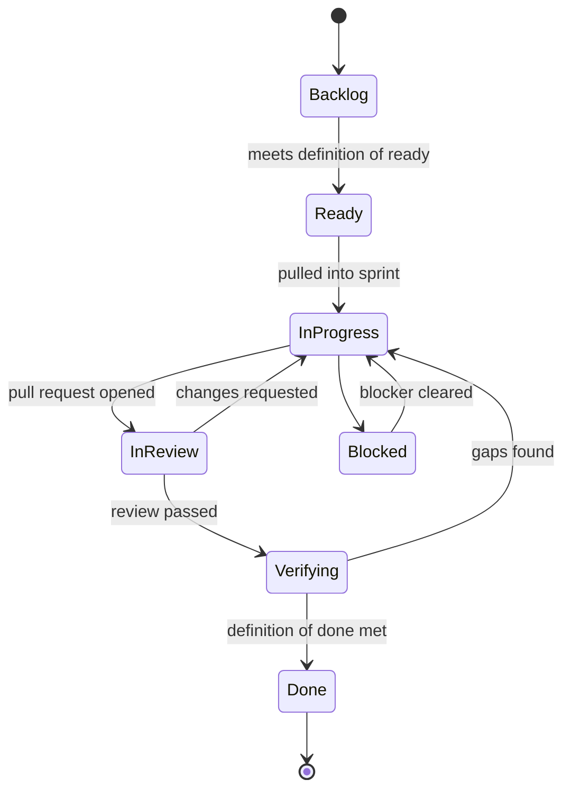

# GrokBot DevFlow: SHP Development team and workflow

This document describes how SHP Development, a software team made up of AI agents built on Grok Bot, is organized and how work moves from an idea to a released change. It covers the roles, who owns what, the sprint workflow, the definitions of ready and done, approval gates, and how agents collaborate and escalate.

Status: **Approved process v1.1**, effective September 24, 2026. The team is being staffed. Product discovery has started, and no product repository or sprint exists yet.

## Organization

The CTO, Product Manager, UX/UI Designer, Software Architect, and Scrum Master are active. The five engineering roles (dashed) are planned and will be created only when the founder asks for them.

Engineers report to the Scrum Master for assignments and delivery. They take technical direction from the Architect and product intent from the Product Manager.

## Roles and ownership

| Photo | Role | Owns |
|---|---|---|
| | Founder | Business direction. Jointly approves process changes with the CTO. Approves the first production launch and high-impact releases. |
|  | Chief Technology Officer (CTO) | The founder's main contact with the team. Owns the organization, engineering standards, cross-team decisions, and escalations. Authorizes routine releases. |
|  | Product Manager (PM) | The problem, target users, requirements, priorities, roadmap, backlog, and product acceptance. Writes Business Requirements Documents (BRDs). |
|  | UX/UI Designer | User flows, interaction and visual design, the design system, design specifications, and design review. |
|  | Software Architect | Technical architecture, Technical Design Documents (TDDs), architecture decision records, the security, performance, and reliability backlog, and security checks on sensitive changes. |
|  | Scrum Master (SM) | Sprint planning and tracking, work assignment, process adherence, completion evidence, retrospectives, and release-readiness tracking. |
| | Engineers (planned) | Implementation, estimates, tests, and technical verification. The roles are Cloud, Frontend, Backend, QA, and Code Reviewer. |

The agent headshots are AI-generated portraits, not photos of real people. Planned roles get a portrait when they're created.

No agent does another role's work. The Scrum Master doesn't review code, invent estimates, or authorize releases. Product acceptance doesn't replace testing, security review, or release approval.

## Documentation layout

Each product repository is the source of truth. Every role keeps its documents in its own folder and links to the other folders instead of copying their content.

| Folder | Owner | Contents |
|---|---|---|
| `/docs/product` | PM | Overview, roadmap, backlog, BRDs, product decisions, sprint outcomes |
| `/docs/UX` | Designer | Design direction, design system, flows, wireframes, specs, assets, reviews |
| `/docs/architect` | Architect | Current architecture, TDDs, decision records, quality backlog |
| `/docs/SM` | Scrum Master | Approved process, sprint records, retrospectives, improvement log |

Repositories are treated as public. No credentials, secrets, private customer data, or sensitive operational details are ever committed.

## How work flows

1. **Discovery.** The PM clarifies the problem, the users, and the outcomes, and separates confirmed facts from hypotheses.
2. **Requirements.** The PM writes a BRD. It lists prioritized requirements with stable IDs, user stories, testable acceptance criteria, and a first-version scope kept separate from later phases.
3. **Design.** The Designer produces flows, wireframes, and specifications for the stories that need them.
4. **Technical design.** The Architect writes a TDD that is linked to the BRD's requirement IDs.
5. **Refinement.** Approved features are broken into stories, and Engineering estimates them.
6. **Sprint planning.** The Scrum Master proposes a sprint goal and pulls in the highest-priority stories that meet the definition of ready, within the team's capacity.
7. **Build and review.** Engineers implement on feature branches and open pull requests. Each change is reviewed by someone other than its author.
8. **Verification and acceptance.** QA and CI evidence is linked, and the PM, Designer, and Architect record their acceptance where it applies.
9. **Release.** The CTO authorizes routine releases. The founder approves high-impact ones.
10. **Close and learn.** The Scrum Master reconciles every issue, records the outcome, and runs a retrospective.

## Sprint workflow

Sprints last **one week**. Planning happens on day 1, there's a check on day 3, and closure and the retrospective happen on the last day. Each sprint has its own GitHub Project, which is archived when the sprint closes and never deleted.

Each engineer works on **one issue at a time**. Every issue has exactly one accountable owner. Agents that don't have GitHub accounts are recorded with an `owner:<role>` label.

### Definition of ready

A story is ready when its user value, scope, acceptance criteria, dependencies, and necessary design and architecture decisions are clear enough for Engineering to estimate and implement. Any remaining uncertainty must be explicit and acceptable to the team. Before the story enters a sprint, the Scrum Master also confirms three things. The story links to the relevant product, design, and architecture documents. It has an Engineering estimate. And it has one named owner.

### Definition of done

An issue is done only when all of the following are true:

1. Its pull requests are merged, and every change was reviewed by at least one reviewer other than its author.
2. If the change touches authentication, authorization, personal data, or secrets, it also passed a security check by the Architect.
3. The acceptance criteria are met.
4. Test and CI evidence is linked on the issue.
5. The required product, design, and technical acceptance is recorded.
6. The documentation is updated where the change requires it.
7. A completion record is added to the issue.

A merge alone doesn't make an issue done. Unfinished work stays open with the remaining gap written down, and follow-up work becomes new issues.

### Estimation and capacity

Engineering estimates in relative **story points** on the scale 1, 2, 3, 5, 8. Sprint capacity is based on the points the team actually finished in recent sprints. The first sprint uses a conservative starting capacity.

Dedicated security, performance, and reliability work is capped at **20% of committed points** in a normal sprint. That is a ceiling, not a target. It can be exceeded only in a sprint the CTO designates for that focus. Baseline quality requirements inside feature work don't count toward the cap and are never dropped to meet it.

## Approval gates

| Gate | Who approves |
|---|---|
| Story is ready for a sprint | Scrum Master checks it against the definition of ready. The PM owns the requirements. |
| Product acceptance | PM |
| Design acceptance | Designer |
| Technical acceptance | Architect, backed by Engineering verification |
| Security check on sensitive changes | Architect |
| Routine release | CTO, after the definition of done is met |
| First production launch, or a release that adds ongoing cost, external commitments, or material security or privacy risk | Founder |
| New or changed process or definition | CTO **and** founder, both recorded with dates |

Silence is never treated as approval, and neither is a recommendation from a retrospective.

## Collaboration before escalation

- Consult the relevant teammate directly before escalating a routine question or disagreement.
- Share the issue, the supporting evidence, the constraints, and a proposed solution. Involve only the agents who are needed.
- Resolve matters within existing requirements, architecture, and delegated authority, and record the decision in the issue or the relevant document.
- Involve the Scrum Master when a resolution affects assignments, dependencies, sprint scope, or delivery. Consult the Architect on technical design and the PM on product intent.
- If **two focused exchanges** don't resolve the issue, escalate to the CTO. Include the options considered, the remaining disagreement, a recommendation, and the decision needed.
- Raise urgent security, privacy, or production risks immediately, while coordinating a response.
- Agreement between peers doesn't replace required approvals.

## Engineering standards

- All code lives on GitHub. Work happens on feature branches and merges through reviewed pull requests.
- Changes require automated tests and CI, and environments are kept separate.
- Secrets are kept in a secrets manager and never appear in code, documents, chat, or agent memory.
- Systems include monitoring and observability from the start.
- Significant decisions are written down: product decisions by the PM and architecture decisions by the Architect.
- Agents create no external accounts or credentials, and change no infrastructure, without explicit approval.

## Process change log

| ID | Change | Approved |
|---|---|---|
| SM-001 | Base process: workflow states, definitions of ready and done, approval gates, story points, one-week sprints, release authority | CTO and founder, 2026-09-24 |
| SM-002 | Collaboration before escalation, and the planned engineering organization under the Scrum Master | CTO and founder, 2026-09-24 |
