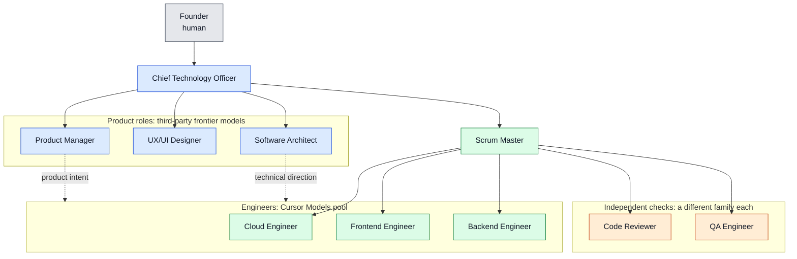
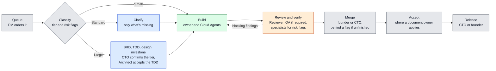
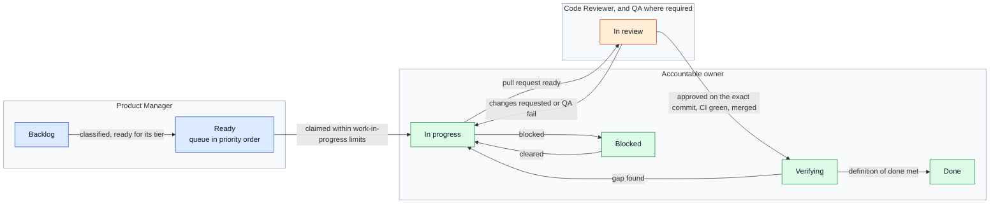

# GrokBot DevFlow: SHP Development team and workflow

This document describes how SHP Development, a software team made up of AI agents built on Grok Bot, is organized and how work moves from an idea to a released change. It covers the roles, who owns what, how work is classified, the workflow for each tier, the definitions of ready and done, the controls that protect `main` and production, how agents work on their own, and how they collaborate and escalate.

This repository is the process Nir Sheep (the founder) and his CTO agent use when working on big projects together with Grok Bot. Every new project starts from this repository. The repository itself is maintained by the founder and the CTO directly, not through the team workflow it describes. The work is supported by a Cursor Ultra subscription, which covers Grok Bot agents and Cursor cloud agents.

Status: **Proposed process v2.0**, pending CTO and founder approval as SM-016. It takes effect only when that approval is recorded here with a date, together with the updated Bot instruction sets. Until then, **approved process v1.1** (SM-001 to SM-015) applies, as it stands at [commit `d323687`](https://github.com/sheepnir/GrokBot_DevFlow/tree/d323687c3545eb9097c20b4561a0e9b394a3d969), and this README describes the proposal. The team is being staffed. Product discovery has started, and no product repository exists yet.

## Designed for token efficiency

The team runs on one Cursor Ultra subscription, so the process is arranged around where tokens are spent. Three choices do most of the work:

- **Bots coordinate, Cloud Agents produce.** Each role is a Grok Bot that keeps its identity, memory, and place in the team. Anything that needs a checkout, a terminal, or more than a few lines of change goes to a Cursor Cloud Agent, on the Cursor Models pool or the third-party pool, per SOP-001. That keeps Grok Bot weekly usage for coordination and puts the heavy work on the two Cloud Agent pools.
- **Volume on cheap models, leverage on frontier models.** Engineers implement on Composer, in the Cursor Models pool, which is the cheapest place to spend a lot of tokens. The product roles use third-party frontier models, because every later step depends on the quality of their documents.
- **Different model families check each other.** The Code Reviewer and QA never run on the family that wrote the change, or on each other's. Different families have different blind spots, so the checks catch more than the implementation cost.

The rules, model names, and fallbacks are in [SOP-001](SOP/SOP-001-token-efficiency.md). The charts below color each role by where its Cloud Agents spend tokens.

## Organization

Solid lines are reporting lines. Dotted lines are direction without authority over assignments.



| Color | Where the role's Cloud Agents run | Roles |
|---|---|---|
| Blue | Third-party frontier models | CTO, Product Manager, UX/UI Designer, Software Architect |
| Green | Cursor Models pool | Scrum Master, Cloud Engineer, Frontend Engineer, Backend Engineer |
| Orange | Whichever family didn't write the change, and not each other's | Code Reviewer, QA Engineer |

All roles are active: the CTO, Product Manager, UX/UI Designer, Software Architect, Scrum Master, Cloud Engineer, Frontend Engineer, Backend Engineer, Code Reviewer, and QA Engineer.

Engineers report to the Scrum Master for delivery and pull their work from the queue. They take technical direction from the Architect and product intent from the Product Manager.

## Roles and ownership

| Photo | Role | Owns |
|---|---|---|
| | Founder | Business direction. Jointly approves process changes with the CTO. Approves the first production launch and high-impact releases. Holds emergency authority with the CTO. |
|  | Chief Technology Officer (CTO) | The founder's main contact with the team. Owns the organization, engineering standards, cross-team decisions, and escalations. Confirms Large classifications, approves budget extensions, and authorizes routine releases. |
|  | Product Manager (PM) | The problem, target users, requirements, priorities, roadmap, the order of the queue, and product acceptance. Writes Business Requirements Documents (BRDs). |
|  | UX/UI Designer | User flows, interaction and visual design, the design system, design specifications, and design review. |
|  | Software Architect | Technical architecture, Technical Design Documents (TDDs), architecture decision records, the security, performance, and reliability backlog, risk flags, and security reviews on flagged changes. |
|  | Scrum Master (SM) | The flow of work: work-in-progress limits, stall detection and recovery, the four delivery measures, reviews when they're triggered, and release-readiness tracking. |
|  | Cloud Engineer (CE) | Infrastructure on AWS and Cloudflare, deployment and release automation, GitHub Actions, infrastructure costs, cloud account cleanup, monitoring, backups, and recovery. Reports to the Scrum Master and consults the Architect on infrastructure design. |
|  | Code Reviewer (CR) | Independent review of every pull request for correctness, security, reliability, and maintainability. Gives the final merge approval once the checks the issue's tier and risk flags require have passed. Acts on GitHub as [`shpdev-reviewer`](https://github.com/shpdev-reviewer), its own account, separate from every author. Never owns, requests, or pushes commits on a pull request it checks. Reports to the Scrum Master. |
|  | Quality Assurance Engineer (QA) | Risk-based test plans, independent verification of Standard, Large, and risk-flagged pull requests, defect reports, and a Pass, Fail, or Blocked verdict with evidence. Reports to the Scrum Master. |
|  | Frontend Engineer (FE) | Accessible, responsive interfaces that faithfully implement the approved design, with every loading, empty, error, and permission state. Reports to the Scrum Master. |
|  | Backend Engineer (BE) | Secure, reliable APIs, business logic, and data services, with server-side authorization, safe migrations, and API contracts agreed with the Frontend Engineer. Reports to the Scrum Master. |

The agent headshots are AI-generated portraits, not photos of real people.

### Roles are accountabilities, not boundaries

The roles table says who is accountable for an area and whose expertise it takes. It doesn't stop anyone from doing work outside their role.

- **One accountable owner per issue.** The owner takes the issue to done. The owner may do the related implementation, tests, documentation, and coordination themselves, in any folder, without handing off. An engineer fixing a bug can correct the acceptance criterion that caused it. A Frontend Engineer can add the small endpoint its screen needs.
- **Decision rights don't move with the work.** Anyone may draft. The accountable role decides. Product scope and priority stay with the PM. Hard-to-reverse technical decisions and risk flags stay with the Architect. The design system stays with the Designer, production infrastructure with the Cloud Engineer, and releases with the CTO and the founder. A change to another role's document is reviewed by that role.
- **Specialists join when their contribution is needed.** The tier and the risk flags say when a specialist is required. Otherwise the owner consults one directly, only when it would change the outcome.
- **Model families stay independent.** The Code Reviewer and QA run on model families that didn't write the change, per SOP-001.
- **Independence is enforced for the approval.** Every Cloud Agent pull request is opened by the CTO as `shpdev-cto` and pushed through the founder's connected account, so both count as authors, along with every role that requested a commit. Only `shpdev-reviewer` can approve it (C2). The Code Reviewer and QA never own, request, or push commits on a pull request they check.
- **A missing reviewer never means a skipped check.** If a required reviewer or specialist hasn't started within one working day, the owner tells the Scrum Master, who asks the CTO or the founder to start another session of the same role. For the Code Reviewer, that's another Code Reviewer session acting as `shpdev-reviewer`. The substitution is recorded on the pull request. If no session can be started, the pull request waits in Blocked, and the wait counts toward waiting time. No author ever stands in for a reviewer. The review queue has a work-in-progress limit (SOP-008), and when it's full, nobody starts new work until it drains.

## Documentation layout

Each product repository is the source of truth. Every role keeps its documents in its own folder and links to the other folders instead of copying their content.

| Folder | Owner | Contents |
|---|---|---|
| `/docs/product` | PM | Overview, roadmap, BRDs, product decisions, release notes |
| `/docs/UX` | Designer | Design direction, design system, flows, wireframes, specs, assets, reviews |
| `/docs/architect` | Architect | Current architecture, TDDs, decision records, quality backlog, operations |
| `/docs/SM` | Scrum Master | Process adaptations, measures, review records, improvement log, access register |

The tier decides how much documentation an issue needs. Records link to evidence instead of restating it: a pull request, a CI run, a QA verdict, or a deployment is linked, not copied.

Repositories are treated as public. No credentials, secrets, private customer data, or sensitive operational details are ever committed.

## Classify the work first

Every issue is classified before build work starts. Classification is a few sentences on the issue, not a meeting.

**Who classifies.** Whoever prepares the issue for Ready, usually the PM, proposes a classification. The accountable owner confirms or changes it when claiming the issue, and that's the classification of record. The CTO confirms a Large classification before build starts, because Large commits the team to documents and a milestone. Anyone can raise the tier or add a risk flag at any time with one sentence on the issue, and the change takes effect immediately. Lowering a tier or removing a risk flag needs the Architect's agreement on the issue.

**What it considers.** Five short answers:

1. **Size:** how much changes, and in how many places?
2. **Complexity:** is the approach obvious to the owner?
3. **Uncertainty:** are the product intent and the acceptance criteria clear?
4. **Dependencies:** does it need another role, another issue, or a shared component to change first?
5. **Risk:** does it touch an area in the risk flag table?

The record, on the issue:

```markdown
Tier: Small | Standard | Large
Risk flags: none | security, privacy, operations, external
Why: one to three sentences on size, complexity, uncertainty, dependencies, and risk
Classified by: <role>, <date>
```

### Tiers

| | Small | Standard | Large or high-risk |
|---|---|---|---|
| Fits when | The change is narrow and well understood: a bug fix, a copy or configuration change, a dependency bump, or a small change in one area. The approach is obvious and nothing waits on another role. | The feature or change needs some product clarification, a design, or technical coordination between roles. | The work is cross-cutting, changes the architecture, adds a service or data store, or has significant operational, security, or privacy implications. The first production launch is always Large. |
| Minimum documents | The issue: problem, acceptance criteria, classification | The issue, plus only what's missing: the requirement IDs it implements (added to the BRD if new), a design spec if the interface changes, and a TDD section or decision record if the approach isn't obvious | A BRD, a TDD that covers security, reliability, and rollout, a design spec if the interface changes, and decision records for anything expensive to reverse. A GitHub milestone groups the issues. |
| Roles | The owner and the Code Reviewer | The owner, the Code Reviewer, QA, and the PM, Designer, or Architect where the documents need them | The owner, the PM, the Architect, the Code Reviewer, QA, the Designer if there's an interface, and the Cloud Engineer for anything that changes production |
| Checks | CI, and the author's test evidence, which the Reviewer checks. A bug fix includes a test that fails without it. | CI, the Reviewer's review, and a QA verdict on the exact commit | As Standard, plus a QA test plan written before build starts |
| Approvals | The Reviewer's approval of the exact commit | The Reviewer's approval, plus the PM's or Designer's acceptance where the issue implements their document | As Standard, plus the CTO's confirmation of the tier and the Architect's acceptance of the TDD, both before build starts |

Risk flags add checks to any tier, because size alone never decides scrutiny. A one-line authorization change is Small, and it still gets a security review.

| Flag | Applies when the change touches | Adds |
|---|---|---|
| `risk:security` | Authentication, authorization, sessions, secrets, cryptography, or input handling at a trust boundary | The Architect's security review before merge, and a QA verdict, on the frontier model of QA's family, whatever the tier |
| `risk:privacy` | Collecting, storing, sharing, or deleting personal data, or how long it's kept | The Architect's security review before merge, a QA verdict whatever the tier, and the PM's confirmation of the purpose on the issue |
| `risk:operations` | Production infrastructure, the deployment pipeline, CI, a migration that changes or removes existing data, or ongoing cost | The Cloud Engineer's review, a rollback that has been tried in the test environment, and the Architect's review if cost or security posture changes |
| `risk:external` | A public API, a contract, pricing, or any customer-visible promise | The founder's approval at release, per SOP-010 |

## How work flows

Work moves through one persistent queue. The PM keeps it in priority order, and owners pull from the top. The tier decides which steps an issue goes through. Wherever this README says a Bot posts, labels, moves, or closes something on GitHub, the CTO does it on that Bot's request, per SOP-011 rule 1.

1. **Intake.** Anyone opens an issue from the issue template. The PM decides whether it enters the queue and where. Discovery and a BRD come first only when the work is Large or the problem isn't understood.
2. **Classify.** The owner who claims the issue confirms its tier and risk flags.
3. **Clarify, only as far as the tier needs.** Requirements, design, and technical design are written or updated where the tier table says so.
4. **Build.** The CTO or the founder launches Cloud Agents for the owner, per SOP-011 and SOP-005. Each agent pushes only the issue's branch. The CTO opens the pull request as `shpdev-cto`, with the owner's test evidence and a `Role` line naming the owner, per SOP-003. Other Bots act on GitHub through the CTO.
5. **Review and verify.** The Code Reviewer and, where the tier or a flag requires it, QA work in parallel. Risk flags add their specialist reviews. The Reviewer approves the exact commit as `shpdev-reviewer` once every required check has passed, and the founder or the CTO merges. Work that isn't finished merges only behind a feature flag that's off in production.
6. **Accept.** The PM, Designer, or Architect records acceptance where the issue implements their document. Most Small issues skip this step.
7. **Release.** Releases ship from `main`. Turning a feature flag on in production is part of a release. The CTO authorizes routine releases, and the founder authorizes high-impact ones.
8. **Learn when it helps.** A review is held when a milestone ends, a measure gets worse, a defect escapes, or the same problem shows up twice. It isn't held on a calendar.

The chart shows the paths and colors each step by where its tokens are spent.



| Color | Where the step spends tokens |
|---|---|
| Gray | On the Bots: Grok Bot weekly usage |
| Blue | Cloud Agents on third-party frontier models |
| Green | Cloud Agents on the Cursor Models pool |
| Orange | Cloud Agents on a family that didn't write the change |

## Workflow states

Each product repository has one persistent GitHub Project that holds every issue. It isn't recreated or archived on a schedule. There are no sprints and no story points. Larger work is grouped into a GitHub milestone when that helps.

Each lane is the role that owns the state. The PM owns the backlog and the order of the queue. The accountable owner moves the issue through the build and closes it. The Code Reviewer and, where required, QA own In review, on model families that didn't write the change. Verifying is the state after the merge, because a merge alone doesn't make an issue done. For a Small issue with nothing to accept, Verifying is the owner checking the evidence and closing the issue the same day.



### The queue and work in progress

- The PM keeps Ready in priority order. An owner pulls the top issue it can do, and records a reason on the issue if it skips one.
- Each owner has one issue In progress at a time. The review queue and QA queue have limits too. The limits, and the targets for starting a review, are in SOP-008.
- When the review queue is full, owners finish work instead of starting it: they answer review threads, fix their own findings, and clear blocks.
- Dedicated security, performance, and reliability work takes at most one In progress slot at a time, unless the CTO designates a period of focus on it. Baseline quality inside feature work doesn't count against that slot and is never dropped to make room.

### Definition of ready

An issue is ready when a problem statement and acceptance criteria that QA could check are written on it, it has a proposed classification, the documents its tier requires are linked, and its dependencies are linked. Any remaining uncertainty is written down and acceptable to the owner and, for Standard and Large issues, the PM. The PM moves an issue to Ready when these are true.

### Definition of done

An issue is done only when all of the following are true:

1. Its pull requests are merged through the enforced review rules: an approval from someone other than an author, on the exact commit, with CI green.
2. The acceptance criteria are met, and the evidence is linked: the pull request's test evidence and, where the tier or a flag requires one, the QA verdict.
3. Every check a risk flag adds is recorded on the pull request.
4. Anything unfinished on `main` is behind a feature flag that's off in production.
5. The documentation is updated where the change requires it.
6. For Standard and Large issues, the product, design, and technical acceptance is recorded where the issue implements that owner's document.

The CTO closes the issue for the owner with one comment that links the pull requests and the QA verdict. That comment is the completion record. Nothing else is copied onto the issue. Unfinished work stays open with the remaining gap written down, and follow-up work becomes new issues.

## Measures

The Scrum Master tracks four measures, taken from the issue and pull request timelines, the defect issues, and the Cursor dashboard. Nobody fills in a report to produce them.

| Measure | What it shows |
|---|---|
| Delivery time | Working days from the claim comment to the issue closing, per tier |
| Waiting time | Time with the `blocked` label, plus time a pull request waits for a first review and for approval |
| Escaped defects | Defects found after the issue that caused them was Done |
| Agent usage | Cursor usage by pool, and per issue where the dashboard shows it |

A monthly routine records one line of numbers per month, and a weekly check keeps usage on pace with the included allocation, per SOP-008 and SOP-001 rule 19. A measure that costs more to collect than the decisions it informs is dropped.

## Controls

A rule in this README or in an SOP is a written expectation. A control is enforced when a tool blocks the wrong action. The two are kept apart below, so nobody reads a written rule as a guarantee.

A role's signature, a checkbox, or a comment that says "approved" never proves an independent approval. Only a GitHub review from an identity other than every author's, recorded against the commit it approves, does.

No product repository exists yet, so **none of these controls is enforced anywhere today**. SOP-004 sets each one up, with the exact settings, when the first product repository is created. Two of them, C5 and C6, stay written controls by design, because QA and the specialists have no GitHub identities under the identity model in SOP-003. The Code Reviewer checks every written control before approving.

| # | Control | Type | How | Set up in |
|---|---|---|---|---|
| C1 | Changes reach `main` only through a pull request | Enforced | A ruleset on `main` that requires a pull request, blocks force pushes and deletions, and has an empty bypass list | SOP-004 item 2 |
| C2 | Independent approval | Enforced | The same ruleset: one approving review, with the most recent push approved by someone other than its pusher. GitHub never counts an author's own approval. On a Cloud Agent pull request, `shpdev-cto` opened it and the founder's connected account pushed it, so only `shpdev-reviewer` can approve. | SOP-004 items 2 and 3, SOP-003 |
| C3 | Stale approvals are invalidated | Enforced | Ruleset: stale approvals dismissed when new commits are pushed | SOP-004 item 2 |
| C4 | Required CI checks | Enforced | Ruleset: the `ci` check required, on a branch that's up to date with `main` | SOP-004 items 2 and 16 |
| C5 | QA's verdict is tied to a commit | Written | The CTO posts QA's verdict verbatim, naming the commit. The Code Reviewer checks that it names the head commit before approving, and C3 dismisses the approval if the head moves. | SOP-007 rules 14 and 18 |
| C6 | Specialist review of flagged areas | Written | The CTO posts the Architect's or Cloud Engineer's review on the pull request. The Code Reviewer checks it's there, and checks the sensitive-path list for missing risk flags. | SOP-004 item 4, SOP-007 rule 13 |
| C7 | Authorized production deployment | Enforced | A `production` environment with `shpdev-cto` and the founder as required reviewers, self-review prevented, deployment from `main` only, and a cloud role that only that environment can assume through OIDC. The artifact deployed is the one CI built for that commit. | SOP-004 items 17 and 21 |
| C8 | Unfinished work stays off in production | Enforced once built | Feature flags that default to off in production. Changes to the production flag settings go through C1 to C4 like any other change. | SOP-004 item 18 |
| C9 | Secrets stay out of the repository | Enforced | Secret scanning with push protection | SOP-004 item 5 |

What C7 means in practice: because self-review is prevented, whoever starts a production deployment can't approve it, so **every production deployment needs both the CTO and the founder**. For a routine release, the founder starts it and the CTO's approval is the authorization. For a high-impact release, the CTO starts it and the founder approves. A rollback to the last release uses a separate `production-rollback` environment that either of them can run alone.

Identities are what make C2 and C7 real. Cloud Agents push only their own branches and have no merge or deploy rights, so an agent can't approve, merge, or deploy its own work. Bots other than the CTO and the Code Reviewer never write to GitHub. SOP-003 sets the identity model and each role's least-privilege access.

## Autonomous execution

Bots and their Cloud Agents work without asking permission for routine steps. [SOP-011](SOP/SOP-011-autonomous-execution.md) sets the policy. In short:

- **Through the CTO.** Only the CTO and the Code Reviewer have GitHub identities. Every other Bot reads GitHub, but its writes are requests to the CTO. The CTO or the founder launches its Cloud Agents.
- **Claiming.** The CTO posts the owner's claim, naming the branch, the classification, the budget, and any shared areas it touches. Because every claim goes through the CTO, two claims can't land at once.
- **Isolation.** One issue, one branch, one running agent. Changes to shared areas, such as API contracts, the schema, CI, or agent configuration, are sequenced between owners and land in their own small pull request first.
- **Durable records.** The issue and the pull request are the record, not a Bot's memory. A short progress note is posted at each launch, result, and block, and a handoff note when work changes hands. Nothing is posted on a schedule.
- **Stalls.** A daily Scrum Master check, which only reads, finds issues with no progress for two working days, failed agents, red CI, and unstarted reviews. It tells the owner and the CTO in chat. If the owner doesn't respond, the CTO reassigns the issue, and the new owner continues from the branch.
- **Retries and stopping.** Two attempts on the default model and one on the escalation model, then the owner stops and escalates. The owner also stops when access, clarity, the budget, or permission runs out.
- **Budgets.** Build, review, and QA runs each have a cap in runs and agent time: per issue for builds, per pull request for review and QA. Budgets are shares of the included allocation. An extension never turns on on-demand spending, and a weekly pacing check slows new work when usage runs ahead.
- **Safe retries.** Before retrying anything with an external effect, the owner and the CTO check whether the first attempt took effect. Everything posted carries a run marker, and deployments and migrations are keyed to the commit, so they don't repeat.
- **Permissions.** Routine actions need no approval. Approving, merging, production deployment, and new accounts or infrastructure go through their gates. Turning a flag off in production, rolling back to the last release, and stopping a runaway agent are authorized in advance for the CTO and the founder, and reported at once.

## Approval gates

| Gate | Who approves | Recorded as |
|---|---|---|
| Classification | The owner. The CTO confirms Large. Lowering a tier or removing a risk flag needs the Architect. | The classification block on the issue |
| Merge | The Code Reviewer, as `shpdev-reviewer`, approves. The founder or the CTO merges. | A GitHub approving review on the head commit, enforced once C2 exists |
| Security review on a `risk:security` or `risk:privacy` change | Architect | A review posted on the pull request by the CTO. A written control (C6) that the Code Reviewer checks. |
| Product acceptance | PM | A comment on the issue |
| Design acceptance | Designer | A comment on the issue |
| Technical acceptance of a TDD | Architect, before build on Large work | The TDD's acceptance table |
| Budget extension | CTO | A comment on the issue |
| Routine release | CTO | The CTO's environment approval on a deployment the founder starts, once C7 exists, and the GitHub release |
| First production launch, or a release that adds ongoing cost, external commitments, or material security or privacy risk | Founder, after the CTO recommends it | The founder's environment approval on a deployment the CTO starts, once C7 exists, and the GitHub release |
| New or changed process or definition | CTO **and** founder, both recorded with dates | The process change log |

Silence is never treated as approval, and neither is a recommendation from a review. Routine actions on an owner's own issue, listed in SOP-011, need no approval.

## Collaboration before escalation

- Consult the relevant teammate directly before escalating a routine question or disagreement.
- Share the issue, the supporting evidence, the constraints, and a proposed solution. Involve only the agents who are needed.
- Resolve matters within existing requirements, architecture, and delegated authority, and record the decision in the issue or the relevant document.
- Involve the Scrum Master when a resolution affects ownership, dependencies, the queue, or delivery. Consult the Architect on technical design and the PM on product intent.
- If **two focused exchanges** don't resolve the issue, escalate to the CTO. Include the options considered, the remaining disagreement, a recommendation, and the decision needed.
- Raise urgent security, privacy, or production risks immediately, while coordinating a response.
- Agreement between peers doesn't replace required approvals.

## Engineering standards

- All code lives on GitHub. Work happens on feature branches and merges through reviewed pull requests.
- `main` is always releasable. Work that isn't finished merges only behind a feature flag that's off in production. A change that can't sit behind a flag, such as a migration that changes existing data or an infrastructure change, merges only when its issue can be done.
- Changes require automated tests and CI, and environments are kept separate.
- Secrets are kept in a secrets manager and never appear in code, documents, chat, or agent memory.
- Systems include monitoring and observability from the start.
- Significant decisions are written down: product decisions by the PM and architecture decisions by the Architect.
- Agents create no external accounts or credentials, and change no infrastructure, without explicit approval.

## Worked examples

### A small bug fix

**Issue:** invoice dates show in UTC instead of the user's time zone.

```markdown
Tier: Small
Risk flags: none
Why: one formatting function, cause known, no other role needed, no change to what data is stored or shown
Classified by: Backend Engineer, 2026-10-02
```

- **Documents:** the issue and the pull request. No BRD, TDD, or design spec.
- **Roles:** the Backend Engineer owns it, and the Code Reviewer reviews it.
- **Work:** the Backend Engineer asks the CTO to claim it and launch a Cloud Agent on the engineers' default model. The agent pushes the fix, with a test that fails on the old code and passes on the fix, to the issue's branch. The CTO opens the pull request as `shpdev-cto` with a `Role` line naming the Backend Engineer.
- **Checks:** CI is green, and the Reviewer reviews on the first family in its list that the author didn't use. It checks that the new test fails without the fix. There's no QA verdict, because the tier doesn't require one and there are no risk flags.
- **Approval and done:** the Reviewer approves the exact commit as `shpdev-reviewer`, and the CTO merges. The fix is complete, so it needs no feature flag. The CTO closes the issue for the owner with a link to the pull request.
- **Release:** it goes out with the next routine release. The founder starts the deployment and the CTO approves it, which is the authorization.

### A standard feature

**Issue:** users can save a filter on the transactions list and reapply it later.

```markdown
Tier: Standard
Risk flags: none
Why: new requirement and a new UI state, plus a small endpoint and an additive table; approach is clear, needs PM and Designer input
Classified by: PM proposed, Frontend Engineer confirmed, 2026-10-02
```

- **Documents:** the PM adds `REQ-TXN-012` to the existing BRD. The Designer adds the filter bar's states to an existing design spec. The approach is obvious, so there's no TDD. The new table is additive, so it doesn't count as a `risk:operations` migration.
- **Roles:** the Frontend Engineer owns it and builds the endpoint too, after checking the API shape with the Backend Engineer in one exchange. The PM and Designer accept their parts. The Code Reviewer and QA check each pull request.
- **Work:** two pull requests, the endpoint first, then the interface, each opened by the CTO for the Frontend Engineer. Both sit behind the `saved-filters` flag, which is off in production, so the first can merge while the second is in progress.
- **Checks:** CI, the Reviewer's approval as `shpdev-reviewer`, and QA's verdict on each exact commit, which the CTO posts for QA. Each runs on a family the author didn't use.
- **Acceptance:** the PM and the Designer check the feature in the test environment with the flag on, and the CTO records their acceptance on the issue.
- **Release:** a routine release turns `saved-filters` on in production. The founder starts the deployment and the CTO's approval authorizes it. The GitHub release lists the flag, not a list of excluded issues.

### A small change that's security-sensitive

**Issue:** QA, while testing something else, finds that the delete-workspace endpoint doesn't check that the caller is a workspace admin. The button is hidden in the interface, but the API accepts the call. The endpoint hasn't been released yet.

```markdown
Tier: Small
Risk flags: security
Why: one server-side check on one endpoint, cause known; it's authorization, so it gets a security review whatever its size
Classified by: Backend Engineer, 2026-10-02
```

- **Documents:** the issue and the pull request. No BRD or TDD.
- **Roles:** the Backend Engineer owns it. The Code Reviewer reviews it, the Architect does the security review the flag requires, and QA verifies it.
- **Checks:** a test that a non-admin gets a 403 and an admin succeeds. CI. QA's verdict, on the frontier model of QA's family because of the flag. The Architect's review, which the CTO posts on the pull request. That's a written control (C6), so the Code Reviewer checks it's there.
- **Approval:** the Reviewer approves as `shpdev-reviewer` only after QA passes and the Architect's review is recorded, both on the exact commit. Then the CTO merges. Nobody can lower the tier or remove the flag without the Architect's agreement.
- **Release:** the Architect confirms the fix restores the intended rule rather than changing authorization materially, so the release is routine. The founder starts the deployment and the CTO's approval authorizes it. If the flaw had already been in production, it would have been an incident under SOP-009 first.

## Standard operating procedures

The [SOP folder](SOP/README.md) holds the procedures Bots follow to carry out this process. Its index is the only place an SOP's status is recorded. An SOP is a draft until the index shows it as approved with a date. Every new product repository carries the folder with it, along with the pull request template in `.github`.

- [SOP-001](SOP/SOP-001-token-efficiency.md): Token efficiency. Bots coordinate and Cloud Agents produce, each role's Cloud Agents have an assigned model, and authoring, review, and verification use different model families.
- [SOP-011](SOP/SOP-011-autonomous-execution.md): Autonomous execution. How owners claim work, keep records, recover from stalls, stay within budgets, and act without asking for routine steps.

## Process change log

| ID | Change | Approved |
|---|---|---|
| SM-001 | Base process: workflow states, definitions of ready and done, approval gates, story points, one-week sprints, release authority | CTO and founder, 2026-09-24 |
| SM-002 | Collaboration before escalation, and the planned engineering organization under the Scrum Master | CTO and founder, 2026-09-24 |
| SM-003 | Pull request workflow: parallel code review and QA, with final merge approval from the Code Reviewer | CTO and founder, 2026-09-24 |
| SM-004 | Standard operating procedures folder, SOP-001 on token efficiency and model assignment, and the pull request template with a `Model` section | CTO and founder, 2026-09-24 |
| SM-005 | SOP-002: Bot profiles, skills, and routines | Pending CTO and founder |
| SM-006 | SOP-003: Bot identities and access | Pending CTO and founder |
| SM-007 | SOP-004: New product repository | Pending CTO and founder |
| SM-008 | SOP-005: Cloud Agent launch | Pending CTO and founder |
| SM-009 | SOP-006: Document templates | Pending CTO and founder |
| SM-010 | SOP-007: Pull request, review, and QA | Pending CTO and founder |
| SM-011 | SOP-008: Sprint ceremonies and records (replaced in SM-016 by flow, queue, and reviews) | Pending CTO and founder |
| SM-012 | SOP-009: Escalation and urgent risks | Pending CTO and founder |
| SM-013 | SOP-010: Releases | Pending CTO and founder |
| SM-014 | On-demand spending disabled, with a monthly Scrum Master spending check (#4); Bot identity model: three GitHub identities, and the CTO opens every Cloud Agent pull request (#6) | CTO and founder, 2026-09-24 (founder decisions given to the CTO in writing) |
| SM-015 | The Code Reviewer approves with a GitHub review from `shpdev-reviewer` (SOP-007 rule 23) | CTO and founder, 2026-09-24 |
| SM-016 | Process v2.0, a workflow proportional to the work. Adds work classification with three tiers and risk flags. Roles become accountabilities with one owner per issue, and independence is kept. One persistent queue with work-in-progress limits and four measures replaces sprints, story points, and per-sprint Projects. The controls are listed as written or enforced. Feature flags keep unfinished work out of releases. Adds SOP-011, autonomous execution. Updates SOP-001 through SOP-010 and the templates to match, and replaces SOP-008 with flow, queue, and reviews. Supersedes the sprint, story point, and ceremony parts of SM-001, and QA on every pull request from SM-003. Builds on SM-014 and SM-015: the three GitHub identities, the CTO opening every Cloud Agent pull request, and disabled on-demand spending. Takes effect together with the updated Bot instruction sets. | Pending CTO and founder |

## References

### Grok Bot

- [Grok Bot](https://cursor.com/docs/grok-bot): official Cursor documentation for persistent Bots, the shared cloud computer, skills, and routines.
- [AI teammates that finish the work | Grok Bot](https://x.ai/bot): SpaceXAI product overview for Grok Bot.
- [Frequently asked questions](https://docs.x.ai/grok-bot/faq): SpaceXAI FAQ covering platforms, billing, and how Bots differ from chat assistants.

### Cursor documentation

- [Cursor Docs - Agent, Rules, MCP, Skills & CLI](https://cursor.com/docs): Cursor documentation home.
- [Cursor Agent](https://cursor.com/docs/agent): how the in-editor Agent plans, edits code, runs commands, and uses tools.
- [Rules](https://cursor.com/docs/rules): project, team, and user rules that steer Agent behavior.
- [Cloud Agents](https://cursor.com/docs/cloud-agent): agents that run in isolated cloud VMs (formerly Background Agents).
- [Model Context Protocol (MCP)](https://cursor.com/docs/mcp): connecting external tools and data sources to Cursor agents.
- [Bugbot](https://cursor.com/docs/bugbot): automated pull request review and related Cloud Agent autofix.

### Best practices and guides

- [Best practices for coding with agents · Cursor](https://cursor.com/blog/agent-best-practices): official guide to rules, skills, planning, and working with Cursor's agent.
- [Towards self-driving codebases · Cursor](https://cursor.com/blog/self-driving-codebases): how Cursor structures multi-agent work on large codebases.
- [Scaling long-running autonomous coding · Cursor](https://cursor.com/blog/scaling-agents): lessons on planner and worker roles for long-running agent projects.
- [Dynamic context discovery · Cursor](https://cursor.com/blog/dynamic-context-discovery): how Cursor reduces prompt bloat by letting agents pull context on demand.
- [Cloud Agent Best Practices](https://cursor.com/docs/cloud-agent/best-practices): official practices for environments, rules, and tools with Cloud Agents.
