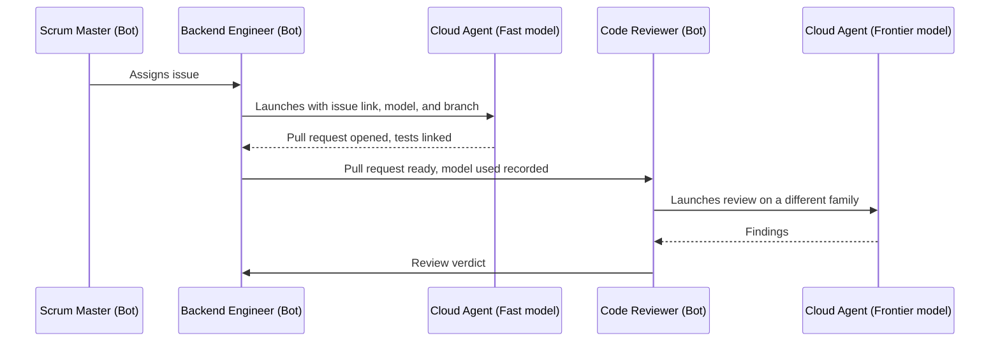

# SOP-001: Token efficiency

Bots, Cloud Agents, and model assignment.

| | |
|---|---|
| Owner | CTO |
| Status | Draft |
| Applies to | Every Bot on the SHP Development team |
| Related | [Root README](../README.md), [Grok Bot plans and billing](https://cursor.com/help/grok-bot/plans), [Cloud Agents](https://cursor.com/docs/cloud-agent), [Cloud Agent best practices](https://cursor.com/docs/cloud-agent/best-practices) |

## Purpose

The team runs on one Cursor Ultra subscription. It has two separate usage budgets: the Grok Bot weekly allowance, metered in agent steps and tokens, and the Cursor Agent allowance, which Cloud Agents draw on at API rates set by the model chosen. This SOP puts each kind of work on the right budget and the right model, so that quality goes where it compounds and volume goes where it's cheap.

Three principles decide everything below:

1. **Bots coordinate, Cloud Agents produce.** A Bot's value is its persistent identity, memory, and place in the team. Repository work is delegated.
2. **Spend on leverage, not on volume.** Documents that every later step depends on get frontier models. High-volume, iterative work gets fast models, with an escalation path.
3. **Diversify the models that check each other.** A reviewer or verifier never runs on the same model family as the author of the work it checks. Different families have different blind spots.

## Scope

This SOP covers which surface a Bot uses for a task, which model tier each role uses, when a role may move up or down a tier, and the everyday habits that keep context small. It doesn't cover what the roles own or how work is approved. Those are in the root README.

## Model tiers

This is the only place in the SOP that names a model. Update this table when a name changes, and nothing else needs to change.

| Tier | Purpose | Models | Family |
|---|---|---|---|
| Frontier | Documents and decisions that later work depends on. Reviews of sensitive changes. | GPT Sol, GPT Astra | OpenAI |
| Frontier | Same as above | Claude Opus, current version | Anthropic |
| Fast | Implementation, tests, mechanical edits, bookkeeping | Composer, current version | Cursor |
| Fast | Same as above | Grok, current coding model | xAI |
| Verification | Independent verification at a lower cost than Frontier | Claude Sonnet, current version | Anthropic |

A model's family is what matters for the diversity rule. Composer and Grok count as two families.

## Surfaces

| Surface | Budget | Use it for | Never use it for |
|---|---|---|---|
| The Bot itself (Grok Bot) | Grok Bot weekly allowance | Reading and answering messages, keeping role memory, running routines, coordinating with other Bots, updating issues and GitHub Projects, launching and reporting on Cloud Agents, and edits of a few lines to a document it owns | Writing or refactoring code, running test suites, writing a BRD, TDD, design spec, or review from scratch |
| Cursor Cloud Agent | Cursor Agent allowance, at the rate of the chosen model | Anything that reads or changes a repository substantially: documents, code, tests, reviews, verification runs, infrastructure changes | Conversation with the founder or the team. The Bot does that. |

When a Bot isn't sure, the test is: does the task need a full checkout, a terminal, or more than a few lines of change? If yes, it's a Cloud Agent task.

## Role assignments

| Role | Default tier | Model | Notes |
|---|---|---|---|
| CTO | Frontier | Claude Opus or GPT Sol | Decisions, escalations, standards, releases |
| Product Manager | Frontier | GPT Sol | BRDs, backlog priority, product decisions |
| Software Architect | Frontier | Claude Opus | TDDs, decision records, security checks |
| UX/UI Designer | Frontier | Claude Opus | Flows, specs, design reviews |
| Scrum Master | Frontier for planning and retrospectives, Fast for tracking | GPT Sol for planning, Composer for tracking | Sprint goals, capacity, and retrospectives need judgment. Reconciling issues and updating records doesn't. |
| Frontend Engineer | Fast | Composer | See the escalation rule |
| Backend Engineer | Fast | Composer | See the escalation rule |
| Cloud Engineer | Fast, Frontier for infrastructure design | Composer, Claude Opus for design | Infrastructure changes that add cost or change security posture get a Frontier pass before they run |
| Code Reviewer | Frontier | GPT Astra | Never the family of the pull request's author. GPT Sol if Astra is unavailable. |
| QA Engineer | Verification | Claude Sonnet | Claude Opus for changes that touch authentication, authorization, personal data, or secrets. Never the family of the author or the reviewer. |

Where a role lists two models in the same family, either is fine. Where it lists two families, the first is the default.

## Rules

### Delegation

1. A Bot launches a Cloud Agent for every task in the Cloud Agent column of the surfaces table. It doesn't attempt the task itself first.
2. A Cloud Agent launch names the issue, the branch, the model, and the expected output. The Bot links the agent run on the issue.
3. A Bot doesn't wait on an agent by polling. It moves to its next message or routine and picks the result up when the agent reports.

### Model diversity

4. Every pull request records the model that produced it in the description, under the heading `Model`.
5. The Code Reviewer launches its review on a family different from the one recorded on the pull request. If the recorded model is missing, the Reviewer asks for it before reviewing.
6. QA verifies on a family different from both the author's and the Reviewer's.
7. When a Frontier role hands a document to another Frontier role for acceptance, the accepting role uses the other Frontier family where the table allows it.

### Escalation and de-escalation

8. An engineer whose Cloud Agent fails twice on the same failure, with the same root cause, launches the third attempt on a Frontier model and notes the switch on the issue. Two failed attempts on a Fast model cost more than one pass on a Frontier one.
9. A Frontier role uses a Fast model for mechanical edits: renames, formatting, moving sections, updating a table, or applying a reviewer's one-line change.
10. Estimation matters here. A story of 5 or 8 points that keeps escalating is a sign the story is too big or the technical design is missing something. The engineer raises that with the Scrum Master and the Architect instead of escalating a fourth time.

### Context hygiene

11. Standing instructions live in files the agent reads on its own: rules under `.cursor/rules/`, an `AGENTS.md` at the repository root, and skills for repeatable procedures. They're never pasted into a prompt.
12. A prompt links to the owning folder under `/docs` for product, design, or architecture context. It never copies that content in.
13. The Cloud Agent environment is defined in `.cursor/environment.json` and kept working, so no agent spends its run installing dependencies. The Cloud Engineer owns this file.
14. Engineers plan before editing on any story above 2 points, and keep one issue in progress at a time, as the root README requires. A plan that fits in a screen is cheaper than a wrong edit.
15. Agents run the tests that cover their change while iterating, and the full suite once before opening the pull request. Verbose output is trimmed with the quiet or summary flag the tool provides.
16. Bugbot, where enabled, runs in incremental mode so each review covers only new commits. It's a first pass. It doesn't replace the Code Reviewer.
17. A Bot's profile holds only rules that are true every week. Sprint context goes in the sprint record or the issue, not in the profile, so every message doesn't carry it.

### Spend

18. On-demand Grok Bot usage stays off. If the weekly allowance runs out, the Bots pause coordination work until it resets, and the Scrum Master reports it. Turning on-demand usage on is a CTO decision, recorded on the sprint record.
19. The Scrum Master records Cursor Agent usage and Grok Bot usage at the day 3 check and at sprint close, in the sprint record, using the Cursor dashboard. A sprint that spends more than the previous one on fewer finished points gets a retrospective item.
20. Bugbot Autofix, which spawns its own Cloud Agent, stays off unless the CTO turns it on for a repository.

## Escalation

- A Bot that can't tell which surface or tier a task belongs to asks the Scrum Master, once, and records the answer on the issue.
- A recurring disagreement about a role's model assignment goes to the CTO with the usage numbers from the sprint record. Changing a row in the role table is a process change and follows the root README's approval gate.
- If a model in the tier table is unavailable, the role uses the other model in the same tier and tells the Scrum Master. It doesn't switch families without checking the diversity rules.

## Change history

| Date | Change | Approved |
|---|---|---|
| 2026-09-24 | First draft: surfaces, model tiers, role assignments, diversity, escalation, context hygiene, and spend rules | Pending CTO and founder |
