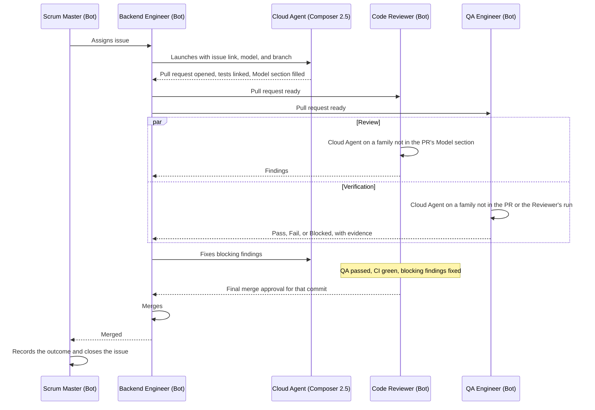

# SOP-001: Token efficiency

Bots, Cloud Agents, and model assignment.

| | |
|---|---|
| Owner | CTO |
| Status | See the [SOP index](README.md). It's the only place status is recorded. |
| Applies to | Every Bot on the SHP Development team |
| Related | [Root README](../README.md), [Cursor models](https://cursor.com/docs/models), [Grok Bot plans and billing](https://cursor.com/help/grok-bot/plans), [Cloud Agents](https://cursor.com/docs/cloud-agent), [Cloud Agent best practices](https://cursor.com/docs/cloud-agent/best-practices), [Bugbot](https://cursor.com/docs/bugbot) |

## Purpose

The team runs on one Cursor Ultra subscription. Cursor meters that subscription on three separate meters:

| Meter | What draws on it | Rate |
|---|---|---|
| Cursor Models pool | Cloud Agents running Cursor's own models: Composer and Grok | Cursor's own rates, well below third-party frontier models |
| Third-party pool | Cloud Agents running OpenAI, Anthropic, or Google models | API rates for the chosen model |
| Grok Bot weekly usage | The Bots themselves: messages, memory, routines, coordination | Agent steps and tokens, reset weekly |

This SOP puts each kind of work on the right meter and the right model, so that quality goes where it compounds and volume goes where it's cheap.

Three principles decide everything below:

1. **Bots coordinate, Cloud Agents produce.** A Bot's value is its persistent identity, memory, and place in the team. Repository work is delegated.
2. **Volume on the Cursor Models pool, leverage on the third-party pool.** Implementation, tests, and bookkeeping run on Composer and Grok. Third-party frontier models are for work where their quality compounds: the documents and decisions that every later step depends on, and the checks that catch what implementation missed.
3. **Diversify the models that check each other.** A reviewer or verifier never runs on the same model family as the author of the work it checks, or as the other checker. Different families have different blind spots.

## Scope

This SOP covers which surface a Bot uses for a task, which model the Cloud Agents launched by each role use, when a role may move up or down a tier, and the everyday habits that keep context small. It doesn't cover what the roles own or how work is approved. Those are in the root README.

It doesn't choose the model a Bot itself runs on. Every Bot runs on Grok Bot. Nothing here changes that.

## Prerequisites

The identity model was decided on 2026-09-24 (#6), per SOP-003. There are three GitHub identities: the founder's personal account, `sheepnir`, which no Bot ever uses; the CTO, `shpdev-cto`; and the Code Reviewer, `shpdev-reviewer`. No other Bot has a GitHub identity, and none needs one. No Bot has cloud access. A Cloud Agent pushes only its branch, through the GitHub account connected to Cursor, which is currently the founder's. The CTO opens the pull request as `shpdev-cto`, fills the template with a `Role` line naming the Bot that requested the work, and requests review from `shpdev-reviewer`. The SOP index records that Bot identities have been in place since 2026-09-24 (#6), so rules 1 through 6 are in full effect. Where those rules or the diagram below say a Bot launches a Cloud Agent, opens a pull request, or merges, the Bot requests it and the CTO does it, or the founder does it on the Bot's behalf. The `Role` line and the `Model` section keep the work attributed to the requesting Bot.

## Model families

This is the only place in the SOP that names a model. Names are written exactly as Cursor's model picker shows them, so a Bot can match them. Update this table when a name changes, and nothing else needs to change.

| Family | Pool | Frontier | Fast or verification |
|---|---|---|---|
| Cursor | Cursor Models | Grok 4.7 | Composer 2.5 |
| OpenAI | Third-party | GPT-5.6 Sol | |
| Anthropic | Third-party | Claude Opus 5.5 | Claude Sonnet 5 |
| Google | Third-party | Gemini 3.1 Pro | Gemini 3.8 Flash |

Grok and Composer count as one family, Cursor, until there's evidence they're independent. That's the conservative reading for the diversity rule.

## Surfaces

| Surface | Meter | Use it for | Never use it for |
|---|---|---|---|
| The Bot itself (Grok Bot) | Grok Bot weekly usage | Reading and answering messages, keeping role memory, running routines, coordinating with other Bots, sprint planning and retrospectives in conversation, updating issues and GitHub Projects, launching and reporting on Cloud Agents, and edits of a few lines to a document it owns | Writing or refactoring code, running test suites, writing a BRD, TDD, design spec, or review from scratch |
| Cursor Cloud Agent | Cursor Models pool or third-party pool, by the chosen model | Anything that reads or changes a repository substantially: documents, code, tests, reviews, verification runs, infrastructure changes | Conversation with the founder or the team. The Bot does that. |

When a Bot isn't sure, the test is: does the task need a full checkout, a terminal, or more than a few lines of change? If yes, it's a Cloud Agent task.

## Role assignments

This table sets the model of the Cloud Agents each role launches. It doesn't and can't set the model of the Bot itself. Every Bot runs on Grok Bot, and work the Bot does in its own conversation, such as the Scrum Master's sprint planning and retrospectives, runs there.

| Role | Cloud Agent model | Escalation or fallback | Notes |
|---|---|---|---|
| CTO | Claude Opus 5.5 | GPT-5.6 Sol | Standards, decision records, release notes |
| Product Manager | GPT-5.6 Sol | Claude Opus 5.5 | BRDs, backlog priority, product decisions |
| Software Architect | Claude Opus 5.5 | GPT-5.6 Sol | TDDs, decision records, security checks |
| UX/UI Designer | Claude Opus 5.5 | GPT-5.6 Sol | Flows, specs, design reviews |
| Scrum Master | Composer 2.5 | Grok 4.7 | Sprint records, retrospective write-ups, issue reconciliation. The judgment happens in the Bot's conversation. The Cloud Agent writes it down. |
| Frontend Engineer | Composer 2.5 | Grok 4.7 | See rule 8 |
| Backend Engineer | Composer 2.5 | Grok 4.7 | See rule 8 |
| Cloud Engineer | Composer 2.5 | Grok 4.7 | Infrastructure changes that add cost or change security posture get the Architect's review, per the root README, before they run |
| Code Reviewer | First available in order: GPT-5.6 Sol, Gemini 3.1 Pro, Claude Opus 5.5, Grok 4.7 | | See rule 5 |
| QA Engineer | First available in order: Claude Sonnet 5, Gemini 3.8 Flash, GPT-5.6 Sol, Composer 2.5 | For changes that touch authentication, authorization, personal data, or secrets, the Frontier model of the same family | See rule 6 |

Engineers escalate to Grok 4.7 because it's the same family as Composer 2.5. An escalation never adds a family to the pull request, so it never takes a family away from the Reviewer or QA. A pull request carries at most two families: a role's default and its fallback, or its default and Composer 2.5 for mechanical edits under rule 9. The Reviewer and QA take one each, so four families are always enough.

## Rules

### Delegation

1. A Bot launches a Cloud Agent for every task in the Cloud Agent column of the surfaces table. It doesn't attempt the task itself first.
2. A Cloud Agent launch names the issue, the branch, the model, and the expected output. The Bot links the agent run on the issue.
3. A Bot doesn't wait on an agent by polling. It moves to its next message or routine and picks the result up when the agent reports.

### Model diversity

4. Every pull request lists, under the `Model` heading of the pull request template, every model that produced a commit on it. An escalation adds a line. The heading is never left empty.
5. The Code Reviewer launches its review on the first family in its ordered list that doesn't appear in the pull request's `Model` section. If the section is missing or empty, the Reviewer asks the author for it before reviewing.
6. QA launches its verification on the first family in its ordered list that appears neither in the pull request's `Model` section nor in the Reviewer's choice. The Reviewer's choice follows from the `Model` section alone, so QA can work it out without waiting, and the two run in parallel as the root README requires.
7. When a Frontier role hands a document to another Frontier role for acceptance, the accepting role uses a different family where the role table allows it.

### Escalation and de-escalation

8. An engineer whose Cloud Agent fails twice with the same root cause launches the third attempt on Grok 4.7 and notes the switch on the issue and in the pull request's `Model` section. Two failed attempts on Composer cost more than one pass on Grok.
9. A Frontier role uses Composer 2.5 for mechanical edits: renames, formatting, moving sections, updating a table, or applying a reviewer's one-line change. If the pull request already lists two families, the mechanical edit uses one of the models already listed.
10. Estimation matters here. A story of 5 or 8 points that keeps escalating is a sign the story is too big or the technical design is missing something. The engineer raises that with the Scrum Master and the Architect instead of escalating a fourth time.

### Context hygiene

11. Standing instructions live in files the agent reads on its own: rules under `.cursor/rules/`, an `AGENTS.md` at the repository root, and skills for repeatable procedures. They're never pasted into a prompt.
12. A prompt links to the owning folder under `/docs` for product, design, or architecture context. It never copies that content in.
13. The Cloud Agent environment is defined in `.cursor/environment.json` and kept working, so no agent spends its run installing dependencies. The Cloud Engineer owns this file.
14. Engineers plan before editing on any story above 2 points, and keep one issue in progress at a time, as the root README requires. A plan that fits in a screen is cheaper than a wrong edit.
15. Agents run the tests that cover their change while iterating, and the full suite once before opening the pull request. Verbose output is trimmed with the quiet or summary flag the tool provides.
16. Bugbot, where enabled, keeps Incremental Review on, so each review covers only new commits. It's a first pass. It doesn't replace the Code Reviewer.
17. A Bot's profile holds only rules that are true every week. Sprint context goes in the sprint record or the issue, not in the profile, so every message doesn't carry it.

### Spend

18. Cursor's on-demand monthly limit is one cap for the whole account. It covers Grok Bot and both Cloud Agent pools together. On-demand spending is disabled, so the team works only within the allocation included in the founder's plans and never pays for on-demand usage. The founder sets the limit in Cursor, and the setting is recorded in the table below. When the included allocation runs out, new work waits for the next period, but a Cloud Agent or Bot that is already running finishes. Enabling on-demand spending needs the founder's approval, recorded on the sprint record.
19. Usage is recorded in the sprint record at the day 3 check and at sprint close, for Grok Bot weekly usage, the Cursor Models pool, and the third-party pool. The Scrum Master reads the numbers in Cursor itself (#5). A sprint that spends more than the previous one on fewer finished points gets a retrospective item. Once a month, at the first sprint close of the month, the Scrum Master also checks Cursor's spending page. It confirms that on-demand spending is still disabled and that on-demand spend is $0, then reports how much of the included allocation has been used to the CTO and the founder. If usage is on pace to run out before the allocation resets, the Scrum Master flags it right away, so the team can slow down before work stops.
20. Bugbot Autofix, which spawns its own Cloud Agent, stays off unless the CTO turns it on for a repository.

| Setting | Value | Set by |
|---|---|---|
| On-demand monthly limit | Disabled, set on 2026-09-24 (#4). No on-demand spend for Grok Bot or Cursor. The Scrum Master checks it monthly under rule 19. | Founder |
| Scrum Master read access to the Cursor dashboard | Set up on 2026-09-24 (#5). The Scrum Master reads usage in Cursor itself. | Founder |

## Escalation

- A Bot that can't tell which surface or model a task belongs to asks the Scrum Master, once, and records the answer on the issue.
- A recurring disagreement about a role's model assignment goes to the CTO with the usage numbers from the sprint record. Changing a row in the role table is a process change and follows the root README's approval gate.
- If a model in the family table is unavailable, the role uses the next model in its escalation or fallback column and tells the Scrum Master. The Reviewer and QA move to the next family in their ordered lists, applying rules 5 and 6 as written.

## Change history

| Date | Change | Approved |
|---|---|---|
| 2026-09-24 | First draft: surfaces, model tiers, role assignments, diversity, escalation, context hygiene, and spend rules | CTO and founder, 2026-09-24 |
| 2026-09-24 | CTO re-review: rule 9 keeps a pull request at two families when a Frontier role also makes a mechanical edit | CTO and founder, 2026-09-24 |
| 2026-09-24 | CTO review: model names as Cursor's picker shows them, Grok 4.7 as the Cursor family's frontier model and the engineers' escalation, Google added as a fourth family, ordered fallback lists for the Reviewer and QA, the three Cursor meters named, the role table scoped to Cloud Agents, QA and merge added to the diagram, PR template with a `Model` section, single account-wide on-demand cap, founder posts usage until the Scrum Master has dashboard access, prerequisites for Bot identities, status kept only in the SOP index | CTO and founder, 2026-09-24 |
| 2026-09-24 | Factual update, not a process change: prerequisites name the CTO's GitHub account, `shpdev-cto`, and the Code Reviewer's, `shpdev-reviewer`; the settings table records that the Scrum Master can read Cursor usage (#5) | CTO and founder, 2026-09-24 |
| 2026-09-24 | Rules 18 and 19 and the settings table: on-demand spending is disabled (#4), enabling it needs the founder, and the Scrum Master checks spending monthly | CTO and founder, 2026-09-24 |
| 2026-09-24 | Prerequisites: the identity model is decided (#6). Three GitHub identities, the CTO opens every Cloud Agent pull request, and rules 1 through 6 are in full effect with the requesting Bot named in the `Role` line | CTO and founder, 2026-09-24 |
